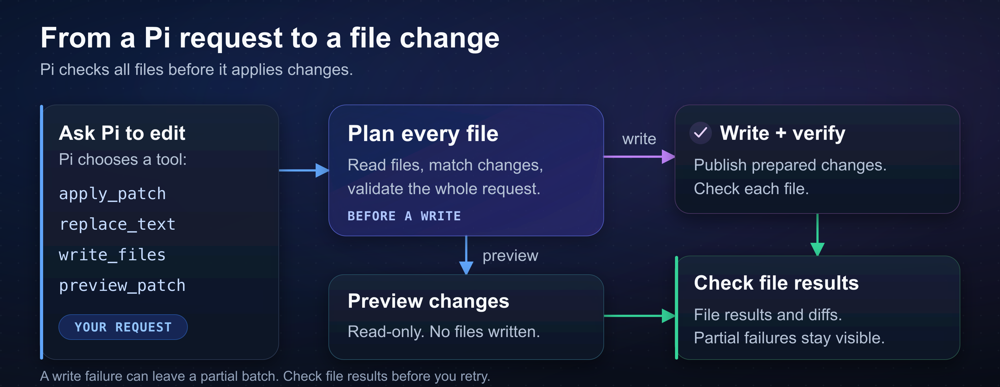

# pi-apply-edits

pi-apply-edits adds multi-file editing tools to [Pi](https://github.com/earendil-works/pi/tree/main/packages/coding-agent).
When a change touches several files, it checks all of them before writing and reports what actually completed.



Every file is planned first. Pi can preview the changes or write them, then show you the per-file results.

## Install and start

You'll need Node 24+ and Pi 1.0.0+. It works with official Pi and Fitch Pi.
The [examples](#examples) show the tool inputs; check [platform setup](#platform-setup) for native-tool requirements.

```sh
pi install git:github.com/fitchmultz/pi-apply-edits
pi
```

Ask Pi for a change as you normally would:

> Rename `oldName` to `newName` in these two files and show me the result.

If Pi is already running, `/reload` refreshes the extension code. Restart after changing dependencies.

## Choose a tool

| What you want to do                                      | Tool            |
| -------------------------------------------------------- | --------------- |
| Patch, create, delete, or move files                     | `apply_patch`   |
| Replace repeated text, an anchored range, or insert text | `replace_text`  |
| Create a file or replace its complete contents           | `write_files`   |
| Inspect a patch without writing                          | `preview_patch` |

Pi chooses the tool from your request. You don't have to preview every edit.

A failure during writing can leave some changes completed and others unfinished.
Check the result before retrying; don't replay an entire partial batch.
Expand the tool result in Pi to see its diffs and file-by-file outcomes.

## Examples

These are the inputs Pi sends to the tools. You can ask for the same changes in plain language.

### Patch a file and add another

`apply_patch` takes this patch text. Send the same patch to `preview_patch` to inspect it without writing.

```text
*** Begin Patch
*** Update File: src/example.ts
@@
-const state = 'old';
+const state = 'new';
*** Add File: src/new.ts
+export const ready = true;
*** End Patch
```

Context must identify a unique match. Patches preserve existing BOMs, local line endings,
final-newline state, and untouched bytes. See the [patch reference](docs/reference.md#patches) for deletions and moves.

### Replace every occurrence

Pass this to `replace_text`:

```json
{
  "files": [
    {
      "path": "src/example.ts",
      "edits": [{ "oldText": "oldName", "newText": "newName", "all": true }]
    }
  ]
}
```

Without `all: true`, the match must be unique. Edits within a file run in order and see earlier edits.
The [replacement reference](docs/reference.md#compact-replacements-and-ranges) also covers ranges and inserts.

### Write complete files

Pass this to `write_files`:

```json
{
  "files": [
    { "path": "src/new.ts", "content": "export {};\n", "mode": "create" },
    { "path": "src/existing.ts", "content": "complete content\n", "mode": "replace" }
  ]
}
```

`create` requires a missing file; `replace` requires an existing one.
Replacements keep the existing UTF-8 BOM and dominant line ending.
Set `preserveFormatting: false` on a file if you want its supplied content written exactly.
Creates always use exact content.

Add top-level `"preview": true` to a `replace_text` or `write_files` call for a read-only preview.
Applying later reads and validates the files again.

## Configuration

When a writing tool is active and replacement is supported, the extension hides Pi's default
`edit` and `write` tools. To keep them too, run `pi --apply-edits-with-builtins` or set
`PI_APPLY_EDITS_KEEP_BUILTINS=1`. Pi's tool selections and exclusions still apply.
Custom and remote writers keep their existing selections; preview-only selections leave writers active.

If you use [pi-change-working-dir](https://github.com/fitchmultz/pi-change-working-dir),
you'll need version 0.5.0 or later. Paths bind to the selected directory before approval;
otherwise they use Pi's session directory.

To try a checkout, run `pi -e /path/to/pi-apply-edits`.
The extension entry is `extensions/apply-edits.ts`.

## Platform setup

Existing-file replacement needs native tools on these platforms:

- macOS uses the system `/bin/cp` and `osascript` to preserve metadata and ACLs.
- Linux requires GNU `/bin/cp` and `getcap`.
- Android/Termux needs `pkg install coreutils attr libacl`. GNU `mv` must support `--exchange` and `--no-clobber`. Extended ACLs and non-SELinux extended attributes are rejected.

On other platforms, you can create files, but existing-file replacement is unavailable.
Pi's default writers stay active when replacement support is unavailable.

Paths are literal: `~` and `file://` aren't expanded, and absolute paths or `..` can reach
outside the working directory. Text writes reject non-UTF-8, NUL-containing, hard-linked,
and non-regular targets. External changes can still race with a write.
Check any reported recovery paths before retrying.

## Reference and development

The [editing reference](docs/reference.md) covers matching rules, previews, result receipts,
and filesystem guarantees. Integrations should read [previews and receipts](docs/reference.md#previews-and-receipts)
and the [0.7 migration notes](docs/reference.md#migration-from-07).

For work on the extension, see [development setup](docs/development.md) and
[code quality and maintainability](QUALITY.md).
[Changelog](CHANGELOG.md) · [Report an issue](https://github.com/fitchmultz/pi-apply-edits/issues)

## License

[MIT](LICENSE). Parser portions are also covered by [Apache-2.0](LICENSE-codex).
